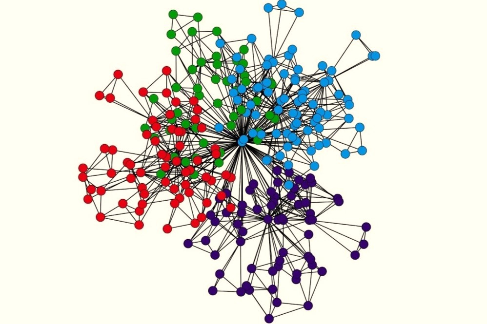
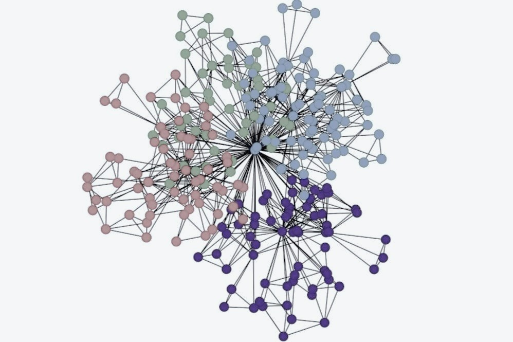

```{r, globalsettings, echo=FALSE, warning=FALSE, results='hide'}
library(knitr)

knitr::opts_chunk$set(echo = TRUE)
opts_chunk$set(tidy.opts=list(width.cutoff=100),tidy=TRUE, warning = FALSE, message = FALSE,comment = "#>", cache=TRUE, class.source=c("test"), class.output=c("test2"))
options(width = 100)
rgl::setupKnitr()

colorize <- function(x, color) {sprintf("<span style='color: %s;'>%s</span>", color, x) }

```

```{r klippy, echo=FALSE, include=FALSE}
klippy::klippy(position = c('top', 'right'))
#klippy::klippy(color = 'darkred')
#klippy::klippy(tooltip_message = 'Click to copy', tooltip_success = 'Done')
```

```{r setup, include=FALSE}
knitr::opts_chunk$set(echo = TRUE)
```

# Brainstorm - Getting back on track

## Project parts

### Research Design

-   Clarify Research Questions

-   Clarify design to answer this question

-   Clarify which data is needed in the design

### Steps to analysis

-   Step 1: Define data

-   Step 2: Create effects structure

-   Step 3: Get initial description

-   Step 4: Specify model

-   Step 5: Estimate model

-   Step 6: Goodness of Fit

### Report writing

-   Introduction

-   Theory

-   Data & Methods

-   Results

-   Discussion & Conclusion

### Simultaneously possible

-   Clarify RQs and Design \<-\> Writing introduction and theory

-   Defining Data & effects structure, initial description and model specification \<-\> Data & Methods part

-   Estimate Model & Goodness of fit \<-\> Results section

-   Afterwards: Discussion and Conclusion

## Timeline

tentative deadline: Saturday, 23.11.24

+--------------------------------------------------------------------+------------------------------------------------+---------------------------------------------------------------+------------------------------------------------------------------------+--------------------------------------------------------------------------+-----------------------------------------------------------------------------------------+------------------------------------------+
| Mon                                                                | Tue                                            | Wed                                                           | Thu                                                                    | Fri                                                                      | Sat                                                                                     | Sun                                      |
+:===================================================================+:===============================================+:==============================================================+:=======================================================================+:=========================================================================+:========================================================================================+:=========================================+
| 28\.                                                               | 29\.                                           | 30\.                                                          | 31\.                                                                   | 01.11.                                                                   | 02\.                                                                                    | 03\.                                     |
|                                                                    |                                                |                                                               |                                                                        |                                                                          |                                                                                         |                                          |
|                                   | {width="952"} | {width="800"}Clarify RQs [D]\ | {width="800"}Intro and theory [W]\ | {width="800"}Intro and theory [W]\       | {width="800"}Define data [S1]                       | {width="800"} |
|                                                                    |                                                | & Clarify design [D]                                          |                                                                        | Clarify [D] & define data [S1]                                           |                                                                                         |                                          |
+--------------------------------------------------------------------+------------------------------------------------+---------------------------------------------------------------+------------------------------------------------------------------------+--------------------------------------------------------------------------+-----------------------------------------------------------------------------------------+------------------------------------------+
| 04\.                                                               | 05\.                                           | 06\.                                                          | 07\.                                                                   | 08\.                                                                     | 09\.                                                                                    | 10\.                                     |
|                                                                    |                                                |                                                               |                                                                        |                                                                          |                                                                                         |                                          |
| {width="800"}Define data [S1]\ | {width="952"} |                              | {width="800"}\                     | {width="800"}Initial description [S3]\   | {width="800"}Plotting                                   | {width="800"} |
| & create effects structure [S2]                                    |                                                |                                                               | Create effects structure [S2]\                                         | & plotting                                                               |                                                                                         |                                          |
+--------------------------------------------------------------------+------------------------------------------------+---------------------------------------------------------------+------------------------------------------------------------------------+--------------------------------------------------------------------------+-----------------------------------------------------------------------------------------+------------------------------------------+
| 11\.                                                               | 12\.                                           | 13\.                                                          | 14\.                                                                   | 15\.                                                                     | 16\.                                                                                    | 17\.                                     |
|                                                                    |                                                |                                                               |                                                                        |                                                                          |                                                                                         |                                          |
| {width="800"}Plotting          | {width="952"} |                              | {width="800"}Specify model [S4]\       | {width="800"}Data & methods [W]          | {width="800"}Estimate model [S5] & goodness of fit [S6] | {width="800"} |
|                                                                    |                                                |                                                               | Data & methods part [W]                                                |                                                                          |                                                                                         |                                          |
+--------------------------------------------------------------------+------------------------------------------------+---------------------------------------------------------------+------------------------------------------------------------------------+--------------------------------------------------------------------------+-----------------------------------------------------------------------------------------+------------------------------------------+
| 18\.                                                               | 19\.                                           | 20\.                                                          | 21\.                                                                   | 22\.                                                                     | **23.**                                                                                 | 24\.                                     |
|                                                                    |                                                |                                                               |                                                                        |                                                                          |                                                                                         |                                          |
| {width="800"}Results [W]       | {width="952"} |                              | {width="800"}Finish results [W]    | {width="800"}Discussion & conclusion [W] | {width="800"}Read over project & hand in!               | {width="800"} |
+--------------------------------------------------------------------+------------------------------------------------+---------------------------------------------------------------+------------------------------------------------------------------------+--------------------------------------------------------------------------+-----------------------------------------------------------------------------------------+------------------------------------------+

: Days overview

**Legend**

::: columns
::: {.column width="50%"}
{width="80"}

{width="80"}
:::

::: {.column width="50%"}
{width="80"}

{width="80"}
:::
:::

[D] = task refers to research design

[S#] = task refers to step of analysis

[W] = task refers to writing the report

### Timeline Question

When is plotting done in this progression? At the initial description part or earlier?

## Project Planning

I have decided to drop another course I was taking and focus on the deadline of this course.

I think the workload of both courses' deadlines exceeds my capacities, especially since the courses of PER 3 already start on 04.11. and I also have duties relating to my board year simultaneously.

### Suggestions for Jochem:

I will update you once a week to inform you of my progress. This can act as an "accountability-measure" and pushes me to face some struggles head-on, that I would otherwise try to avoid. It also creates a predesignated time to discuss the project, which can help me ask questions I would otherwise deem "not important enough to reach out to you".\
I propose that I write you an email about the **current state of affairs on Mondays**, since I cannot work on the project on Tuesday and Wednesday anyways and that gives you some time to reply. Please let me know if this is okay for you.\
In your reply I would appreciate input on how to move on in case I am facing a hurdle that "stalls" the project's progress, and I also welcome redirection if I seem to get "lost in the sauce". Any hints on how to take "shortcuts" that I was not aware of are also very much invited (e.g. "I know of this online resource that is about *exactly* this issue.").

Thank you in advance.

## ACTUAL Timeline

deadline: Saturday, 23.11.24

+---------------------------------------------------------------------------------------------------+--------------------------------------------------------------+-----------------------------------------------------------------+--------------------------------------------------------------------------------------------+-------------------------------------------------------------------------------+------------------------------------------------------------------------------------------------+--------------------------------------------------------------------------+
| Mon                                                                                               | Tue                                                          | Wed                                                             | Thu                                                                                        | Fri                                                                           | Sat                                                                                            | Sun                                                                      |
+:==================================================================================================+:=============================================================+:================================================================+:===========================================================================================+:==============================================================================+:===============================================================================================+:=========================================================================+
| 28\.                                                                                              | 29\.                                                         | 30\.                                                            | 31\.                                                                                       | **01.11.**                                                                    | 02\.                                                                                           | 03\.                                                                     |
|                                                                                                   |                                                              |                                                                 |                                                                                            |                                                                               |                                                                                                |                                                                          |
|                                                                  | {width="952"}               | {width="800"}Clarify RQs [D]\   | {width="800"}Rework schedule [according Jochems input] | {width="800"}\                                | {width="800"}*[chores at home, depression day]*                     | Get polSci data,                     |
|                                                                                                   |                                                              | [Asked Jochem for input]                                        |                                                                                            | Clarify [D]\                                                                  |                                                                                                |                                                                          |
|                                                                                                   |                                                              |                                                                 | OUTLINE Intro and theory [W]\                                                              | & define data [S1]\                                                           |                                                                                                | define data                                                              |
|                                                                                                   |                                                              |                                                                 | (missing H3 still)                                                                         |                                                                               |                                                                                                |                                                                          |
|                                                                                                   |                                                              |                                                                 |                                                                                            | \* struggle with polsci data \*                                               |                                                                                                |                                                                          |
+---------------------------------------------------------------------------------------------------+--------------------------------------------------------------+-----------------------------------------------------------------+--------------------------------------------------------------------------------------------+-------------------------------------------------------------------------------+------------------------------------------------------------------------------------------------+--------------------------------------------------------------------------+
| 04\.                                                                                              | 05\.                                                         | 06\.                                                            | 07\.                                                                                       | 08\.                                                                          | 09\.                                                                                           | 10\.                                                                     |
|                                                                                                   |                                                              |                                                                 |                                                                                            |                                                                               |                                                                                                |                                                                          |
| {width="800"}\                                                | {width="952"}*[work]*       | *[university]*                 | {width="800"}\                                         | {width="800"}\                                | {width="800"}*[personal circumstances]*                            | {width="800"}*[Grandmas bday celebration]*    |
| fix package error,                                                                                |                                                              |                                                                 | Read Jochems answer & revisit code                                                         | fix bugging webjournal                                                        |                                                                                                |                                                                          |
|                                                                                                   | Talk to Jochem                                               |                                                                 |                                                                                            |                                                                               |                                                                                                |                                                                          |
| Define variables (get stuck with sienaDependent)                                                  |                                                              |                                                                 | make h index                                                                               | journal, make submenus                                                        |                                                                                                |                                                                          |
|                                                                                                   | [university]                                                 |                                                                 |                                                                                            |                                                                               |                                                                                                |                                                                          |
| check in with Jochem                                                                              |                                                              |                                                                 |                                                                                            | Restructure code                                                              |                                                                                                |                                                                          |
|                                                                                                   |                                                              |                                                                 |                                                                                            |                                                                               |                                                                                                |                                                                          |
| Plotting                                                                                          |                                                              |                                                                 |                                                                                            | Starting with initial description [S3]                                        |                                                                                                |                                                                          |
|                                                                                                   |                                                              |                                                                 |                                                                                            |                                                                               |                                                                                                |                                                                          |
|                                                                                                   |                                                              |                                                                 |                                                                                            | Plotting                                                                      |                                                                                                |                                                                          |
+---------------------------------------------------------------------------------------------------+--------------------------------------------------------------+-----------------------------------------------------------------+--------------------------------------------------------------------------------------------+-------------------------------------------------------------------------------+------------------------------------------------------------------------------------------------+--------------------------------------------------------------------------+
| 11\.                                                                                              | 12\.                                                         | 13\.                                                            | 14\.                                                                                       | 15\.                                                                          | 16\.                                                                                           | 17\.                                                                     |
|                                                                                                   |                                                              |                                                                 |                                                                                            |                                                                               |                                                                                                |                                                                          |
| {width="800"}Check in with Jochem                             | {width="952"}*[university]* | *[university]*                 | *[Depression]*                                         | *[Depression]*                            | {width="800"}Write data, methods, introduction, and theory [W] | *[university]*                       |
|                                                                                                   |                                                              |                                                                 |                                                                                            |                                                                               |                                                                                                |                                                                          |
| Continue description & plotting [S3]                                                              |                                                              |                                                                 | Continue description & plotting [S3]                                                       | Data & methods part [W]                                                       | estimate model [S5]                                                                            | goodness of fit [S6]                                                     |
|                                                                                                   |                                                              |                                                                 |                                                                                            |                                                                               |                                                                                                |                                                                          |
|                                                                                                   |                                                              |                                                                 |                                                                                            |                                                                               |                                                                                                | Start results                                                            |
+---------------------------------------------------------------------------------------------------+--------------------------------------------------------------+-----------------------------------------------------------------+--------------------------------------------------------------------------------------------+-------------------------------------------------------------------------------+------------------------------------------------------------------------------------------------+--------------------------------------------------------------------------+
| 18\.                                                                                              | 19\.                                                         | 20\.                                                            | 21\.                                                                                       | 22\.                                                                          | **23.**                                                                                        | 24\.                                                                     |
|                                                                                                   |                                                              |                                                                 |                                                                                            |                                                                               |                                                                                                |                                                                          |
| {width="800"}*[RP course starts: little time to work on SNA]* | {width="952"}*[university]* | *[university]*                 | {width="800"}*[LOW capacities]*                        | *[LOW capacities]*                        | {width="800"}Discussion & conclusion [W]                       | *[chores at home, mental breakdown]* |
|                                                                                                   |                                                              |                                                                 |                                                                                            |                                                                               |                                                                                                |                                                                          |
| Check in with Jochem                                                                              |                                                              |                                                                 | Results [W]                                                                                | Finish Results [W]                                                            |                                                                                                | Rework intro [W]                                                         |
+---------------------------------------------------------------------------------------------------+--------------------------------------------------------------+-----------------------------------------------------------------+--------------------------------------------------------------------------------------------+-------------------------------------------------------------------------------+------------------------------------------------------------------------------------------------+--------------------------------------------------------------------------+
| 25\.                                                                                              | 26\.                                                         | 27\.                                                            | 28\.                                                                                       | 29\.                                                                          | 30\.                                                                                           | **1.12.**                                                                |
|                                                                                                   |                                                              |                                                                 |                                                                                            |                                                                               |                                                                                                |                                                                          |
| {width="800"}Discussion & conclusion [W]                          | *[university]*              | {width="800"}*[university]* | {width="800"}*[work, bc I don't want to get fired]*    | *[university]*                            | *[Catch up on uni]*                                                                            | *[Catch up on uni]*                                                      |
|                                                                                                   |                                                              |                                                                 |                                                                                            |                                                                               |                                                                                                |                                                                          |
|                                                                                                   |                                                              | Discussion & conclusion [W]                                     | Finish discussion & conclusion [W]                                                         | {width="800"}**Format project website& hand in!** |                                                                                                |                                                                          |
+---------------------------------------------------------------------------------------------------+--------------------------------------------------------------+-----------------------------------------------------------------+--------------------------------------------------------------------------------------------+-------------------------------------------------------------------------------+------------------------------------------------------------------------------------------------+--------------------------------------------------------------------------+

: Days overview

**Legend**

::: columns
::: {.column width="50%"}
{width="80"}

{width="80"}

{width="80"}
:::

::: {.column width="50%"}
{width="80"}

{width="80"}
:::
:::

[D] = task refers to research design

[S#] = task refers to step of analysis

[W] = task refers to writing the report
